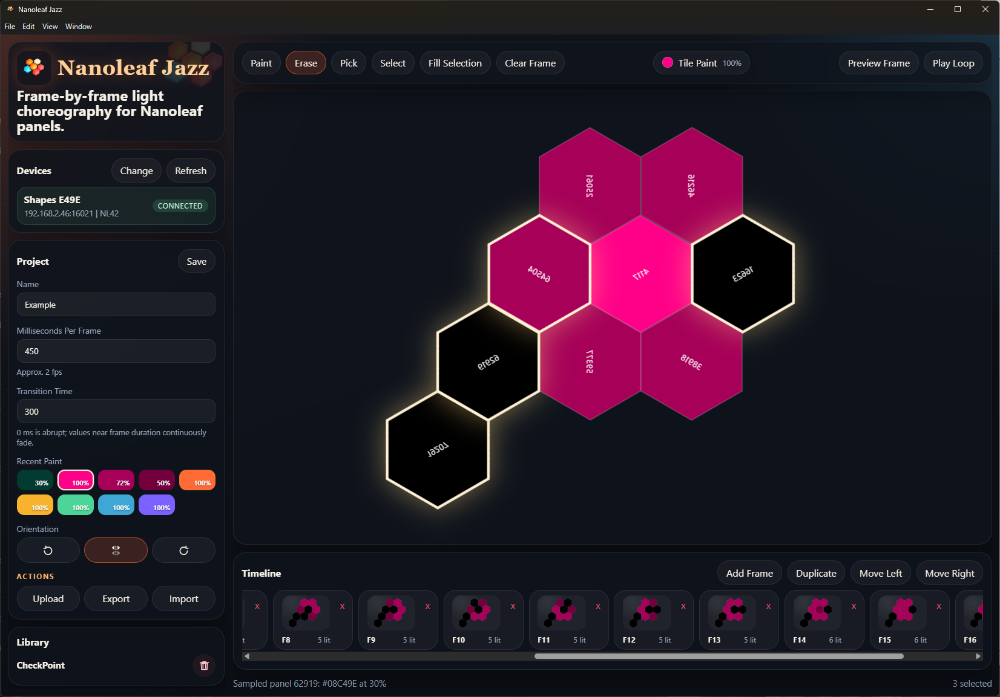

<p align="center">
  
</p>

# Nanoleaf Jazz

<p align="center">
  <strong>Frame-by-frame light choreography for Nanoleaf panels.</strong>
</p>

<p align="center">
  <a href="https://github.com/julianpas/nanoleaf_jazz/actions/workflows/ci.yml"></a>
  <a href="https://github.com/julianpas/nanoleaf_jazz/actions/workflows/github-code-scanning/codeql"></a>
  <a href="https://github.com/julianpas/nanoleaf_jazz/actions/workflows/release.yml"></a>
  <a href="https://github.com/julianpas/nanoleaf_jazz/releases"></a>
  
</p>



Nanoleaf Jazz is a local-first animation editor for Nanoleaf panel devices. It discovers or connects to a controller on your LAN, reads the physical panel layout, lets you paint frame-by-frame animations, previews them live on the device, and can upload the finished animation as a Nanoleaf effect.

## Highlights

- Paint per-panel color and brightness across a timeline of animation frames.
- Preview one frame or loop the full animation on real Nanoleaf lights.
- Upload finished animations to the device as persistent custom effects.
- Use recent paints, tile sampling, fill selection, orientation rotation, and flip controls for faster editing.
- Save projects locally in the browser with IndexedDB and import/export project JSON files.
- Install as a full Electron desktop app or use the lightweight browser launcher.

## Downloads

Pre-built packages are published on the [GitHub Releases page](https://github.com/julianpas/nanoleaf_jazz/releases).

Release assets are split by platform and packaging style:

- `nanoleaf-jazz-electron-installer-windows.exe`
- `nanoleaf-jazz-electron-installer-macos.dmg`
- `nanoleaf-jazz-electron-installer-linux.deb`
- `nanoleaf-jazz-electron-portable-windows.zip`
- `nanoleaf-jazz-electron-portable-macos.zip`
- `nanoleaf-jazz-electron-portable-linux.AppImage`
- `nanoleaf-jazz-browser-launcher-<platform>.zip`

See the [User Guide](docs/USER_GUIDE.md) for installation, pairing, editing, preview, upload, import, and export instructions.

## Documentation

- [User Guide](docs/USER_GUIDE.md): install the app, connect a Nanoleaf device, and use the editor.
- [Developer Guide](docs/DEVELOPER_GUIDE.md): run from source, build packages, understand the architecture, and cut releases.

## Development Quick Start

```bash
npm install
npm run dev
```

The web editor runs on `http://localhost:5173`, and the local bridge runs on `http://localhost:8787`.

For full build and release details, see the [Developer Guide](docs/DEVELOPER_GUIDE.md).
